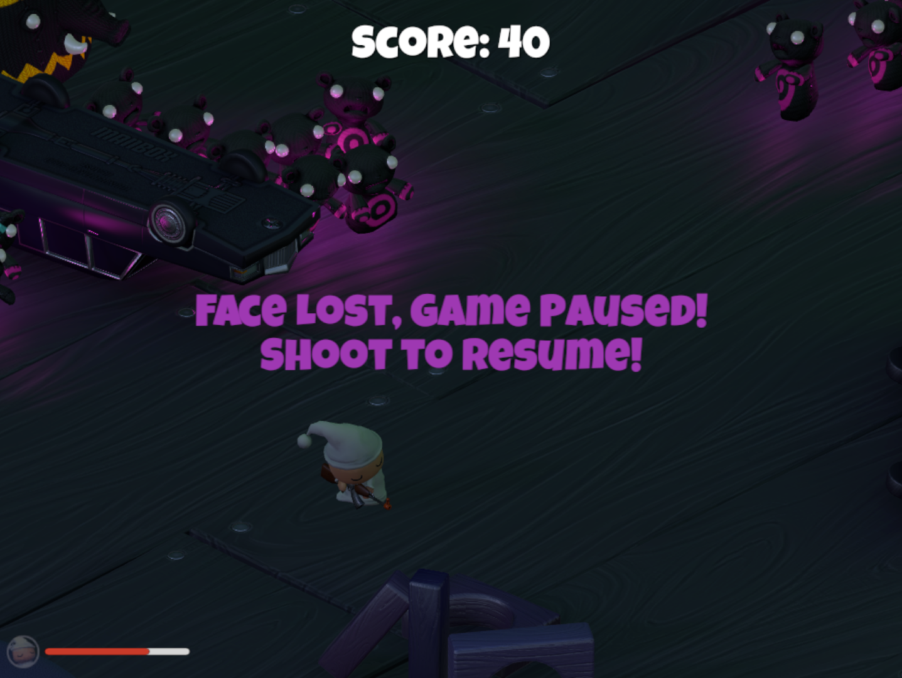

# EmoSurvival (An emotion-enabled version of the Unity Demo)
A 3D cross platform emotional stealth game based on the "Nightmares" demo and built on Unity.
In your dreams of a dark night, you are haunted by fluffy toys who have become zombies. Use your gun and shoot them all to bits and pieces!

### Setup project in Unity :
`git clone https://www.github.com/Affectiva/EmoSurvival.git`  
Open the cloned repository in unity.  File -> Open Scenes -> Level 01 .  Import the Affdex asset from the Unity Asset store.

> ####Controls :
> Move  : w,a,s,d or arrow keys.  
> Shoot : left mouse click.   
> Rotate: through mouse pointer.  
> Pause : cover or turn away from camera.  

### Tutorial :
Unity has a tutorial to develop the original version of this game:
https://unity3d.com/learn/tutorials/projects/survival-shooter-project

### Affdex Unity Asset Documentation :
Instructions on how to emotion enable a game (with examples from EmoSurvival) is here:
http://developer.affectiva.com/unity/
